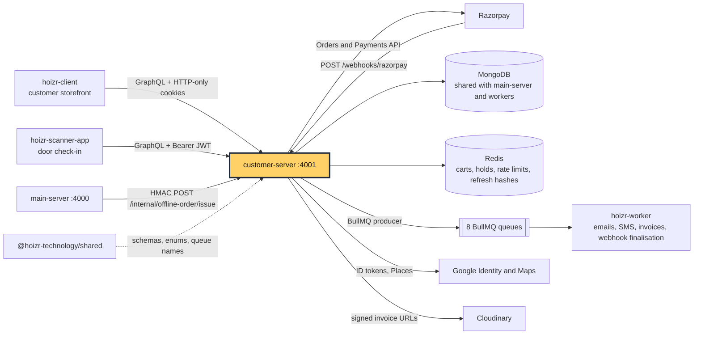
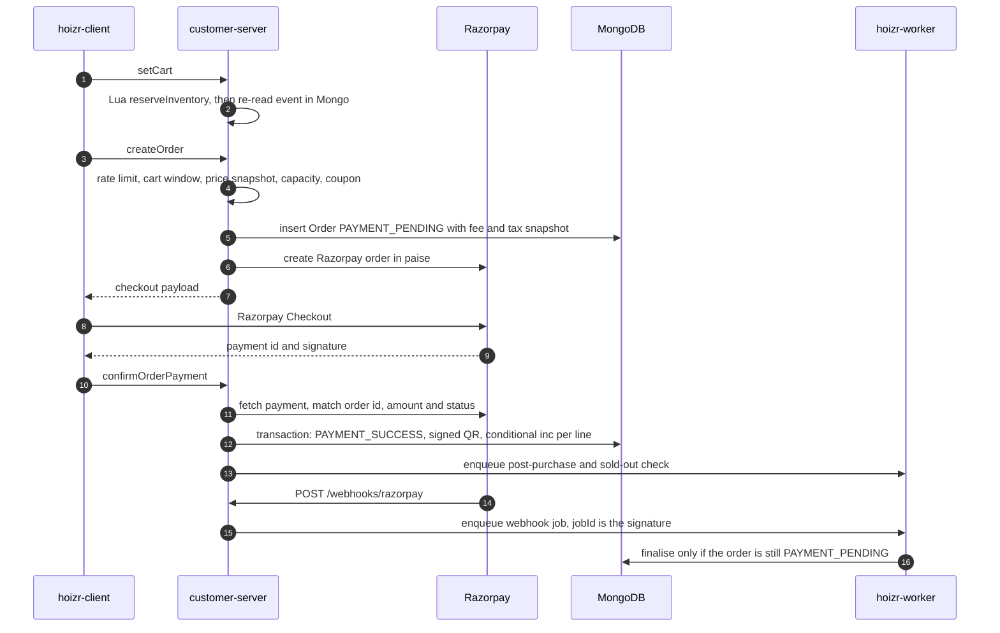
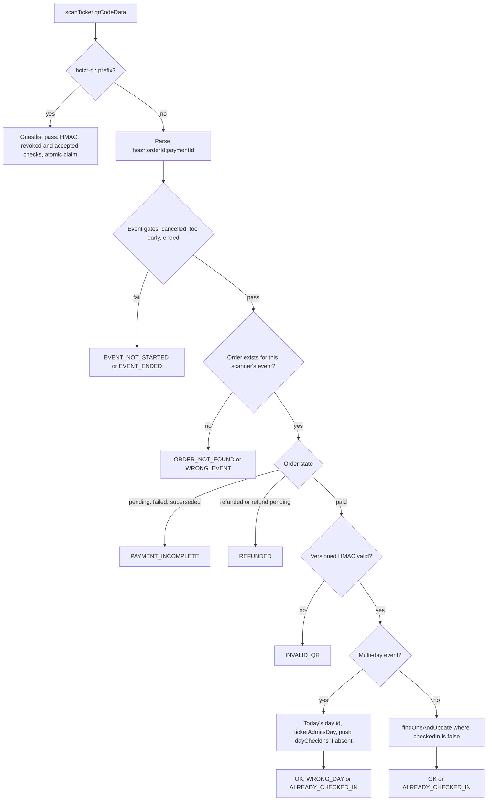

<div align="center">

# Hoizr customer-server

The ticket buyer and door-scanner GraphQL API for Hoizr: sign-in, Redis-held carts, Razorpay checkout and check-in.

[Hoizr walkthrough](https://github.com/Hoizr-Technology/hoizr-walkthrough) · [Architecture](https://github.com/Hoizr-Technology/hoizr-walkthrough/blob/main/docs/01-system-architecture.md) · [Local setup](https://github.com/Hoizr-Technology/hoizr-walkthrough/blob/main/docs/09-local-development.md) · [Contributing](https://github.com/Hoizr-Technology/.github/blob/main/CONTRIBUTING.md)

[](LICENSE)
[](https://fastify.dev/docs/latest/)
[](https://mercurius.dev/)
[](https://mongoosejs.com/docs/)
[](https://docs.bullmq.io/)

</div>

## Where this fits



## About

`customer-server` is the public-facing API of Hoizr, an event ticketing, fan CRM and door-scanning platform for India. Ticket buyers reach it through the [hoizr-client](https://github.com/Hoizr-Technology/hoizr-client) storefront, and door staff reach it through the Flutter [hoizr-scanner-app](https://github.com/Hoizr-Technology/hoizr-scanner-app). It owns the hot path of a sale: browsing published events and venues, holding inventory in Redis while a buyer decides, pricing the cart in integer paise, creating the Razorpay order, finalising the payment inside a MongoDB transaction, and admitting the ticket holder at the door.

Venues and event organizers do not use this server. They manage events, scanners, coupons and offline tickets through [main-server](https://github.com/Hoizr-Technology/main-server), which writes the data this API reads. Slow side effects (ticket emails, SMS, invoices, webhook finalisation, ledger entries) are pushed onto BullMQ and run in [hoizr-worker](https://github.com/Hoizr-Technology/hoizr-worker). The [Hoizr walkthrough](https://github.com/Hoizr-Technology/hoizr-walkthrough) explains the whole system.

## Contents

- [Highlights](#highlights)
- [Features](#features)
- [Tech stack](#tech-stack)
- [Architecture](#architecture)
- [API reference](#api-reference)
- [Getting started](#getting-started)
- [Testing and quality](#testing-and-quality)
- [Known limitations](#known-limitations)
- [Contributing](#contributing)
- [Related repositories](#related-repositories)
- [Author](#author)
- [License](#license)

## Highlights

- **All-or-nothing cart holds in one Lua script.** `reserveInventory` increments a hold counter for every ticket type and add-on in the cart. If any of them would oversell, it rolls back the increments it already applied and reports the key that failed, all inside one atomic `EVAL`. See [src/utils/redis.ts](src/utils/redis.ts). The bound it checks against comes from a pure function with its own regression test: [src/modules/cart/service/inventory-math.ts](src/modules/cart/service/inventory-math.ts).
- **Oversell is stopped in MongoDB, not just in Redis.** Every finalise path (paid, free, offline-issued) runs a conditional `$inc` with an `$expr` capacity check inside a multi-document transaction. A zero match aborts the whole order. See [src/modules/order/service/order.service.ts](src/modules/order/service/order.service.ts).
- **Two payment paths, one guarded finalise.** The browser's `confirmOrderPayment` call and the Razorpay webhook (finalised in `hoizr-worker`) can race. Both write the same order document inside a transaction: the fast path exits if `qrCodeData` is already set, and the worker exits if the order is no longer `PAYMENT_PENDING`. A write conflict makes the loser retry and see the winner's result, so a ticket is never finalised or counted twice. See `confirmPayment` in [src/modules/order/service/order.service.ts](src/modules/order/service/order.service.ts#L2171).
- **Integer-paise pricing with a reconciliation tripwire.** One function prices the cart preview, coupon preview, order creation and offline issue. It apportions coupon discounts across lines, rounds GST per line, and throws if the components do not add up to the exact paise total. See [src/modules/cart/service/cart-pricing.ts](src/modules/cart/service/cart-pricing.ts).
- **Webhook intake that does the minimum.** Raw-body HMAC check with `crypto.timingSafeEqual`, enqueue with `jobId` set to the signature so redeliveries collapse, return 200. Everything else happens in a worker. See [src/routes/razorpay-webhook.route.ts](src/routes/razorpay-webhook.route.ts).
- **Versioned, rotatable ticket QR signatures.** Each order stores the key version that signed its QR. Unknown versions map to an empty key so verification fails closed, and comparison is constant-time. See [src/utils/qr-hash.ts](src/utils/qr-hash.ts).
- **Race-safe door check-in, online and offline.** Check-in is a single `findOneAndUpdate` filtered on `checkedIn: false` (or on today's day id for multi-day passes), so two doors scanning the same ticket cannot both admit it. Scanners can download a manifest and replay offline scans later. See [src/modules/scanner/service/scanner.service.ts](src/modules/scanner/service/scanner.service.ts).
- **Two rate-limiter shapes, both atomic Lua.** An exponential-backoff counter for brute-force caps (OTP, scanner login) and a fixed-window counter for throughput caps (per-IP OTP, order creation). Both fail closed when Redis is down, and the fixed-window one takes an injected client so it can be unit tested. See [src/utils/rateLimit.ts](src/utils/rateLimit.ts).
- **Token hygiene.** RS256 JWTs carry a database-backed `authTokenVersion`, so bumping one counter revokes every session for that customer or scanner. Refresh tokens live in Redis only as SHA-256 hashes: one key per device for customers, a single slot per scanner. See [src/utils/jwt.ts](src/utils/jwt.ts).

## Features

**Accounts**
- Phone OTP sign-up and login. Codes are bcrypt-hashed with a 5-minute expiry, and the OTP record id goes back to the client AES-256-GCM encrypted. Delivery is enqueued for SMS, and also for WhatsApp when that channel is switched on; `hoizr-worker` sends both through MSG91, and both are feature-flagged.
- Sign in with Google (ID token verified server-side). New accounts must verify a phone number before they are created; the pending sign-up lives in Redis under a hash of its token for 10 minutes.
- Sign in with Apple: scaffolded, not enabled (the mutation fails with `APPLE_NOT_CONFIGURED`).
- Profile, push-notification (FCM) token registration, and Google Places address autocomplete.

**Discovery**
- Published events: list and search, lookup by slug or id, lineup and organizer details, artist and organizer past/upcoming events.
- Public venue directory and venue pages.
- Master data: cities, event categories, genres, languages, prohibited items.

**Cart and checkout**
- A 13-minute reservation window per cart, with a price snapshot per line so a price change between cart and checkout is rejected rather than charged.
- Coupons: preview, visible coupons per event, per-customer and total usage caps, day-of-week rules, and automatic deactivation when a cap is reached.
- Razorpay checkout with reuse of an identical pending order, a fresh Razorpay order when the amount drifts, and resume for an abandoned payment popup.
- Free and RSVP orders finalised immediately, with no payment step.
- Offline payment links: an organizer sends a link, the buyer pays through the normal authenticated checkout.

**Orders**
- Order history and detail through a customer-safe view that leaves out internal commission and config fields ([src/modules/order/interfaces/order.view.ts](src/modules/order/interfaces/order.view.ts)).
- Refund requests (the refund itself is issued from the organizer side).
- Invoice download through a 15-minute signed Cloudinary URL. The PDFs are generated by `hoizr-worker`.

**Door scanning** (for the Flutter scanner app)
- Scanner login with an organizer-issued access code, refresh with rotation, and a single active session per scanner.
- Ticket scan with 12 result states, per-day check-in for multi-day events, and guestlist golden passes.
- Offline manifest download and batched replay of offline scans.

**Guestlists, waitlists and loyalty**
- Public guestlists per event and venue, join by code, and a golden-pass QR emailed as an attachment.
- Waitlist join and status. While an event is waitlist-only, the only way to buy is an offline payment link sent by the organizer.
- Venue coupons and loyalty reward claims: points are exchanged for a single-use coupon bound to that customer, inside one transaction.

**Artists and feedback**
- Follow and unfollow artists, artist merch purchase through Razorpay, and post-event feedback.

**Scaffolded or feature-flagged**
- Instagram profile connect (built on Instagram API with Instagram Login). It is scaffolded and falls back to a stub until the Meta app is configured.
- An optional, feature-flagged restaurant-reservation integration over Swiggy's MCP API (`src/modules/dineout`), off by default.

## Tech stack

Versions are the ranges declared in [package.json](package.json).

| Technology | Version | Purpose here | Docs |
|---|---|---|---|
| Node.js | 20.9+ or 22+ | Runtime (the range Mercurius 15 supports) | [nodejs.org](https://nodejs.org/docs/latest-v20.x/api/) |
| TypeScript | ^5.7.3 | Language. Decorator metadata is on for TypeGraphQL and Typegoose | [typescriptlang.org](https://www.typescriptlang.org/docs/) |
| Fastify | ^5.1.0 | HTTP server, webhook, OAuth and internal routes | [fastify.dev](https://fastify.dev/docs/latest/) |
| Mercurius | ^15.1.0 | GraphQL on Fastify: request context, error formatter, query depth limit, GraphiQL | [mercurius.dev](https://mercurius.dev/) |
| TypeGraphQL | ^2.0.0-rc.1 | Code-first resolvers; guards through `@UseMiddleware` | [typegraphql.com](https://typegraphql.com/) |
| graphql / @graphql-tools/schema | ^16.14.0 / ^10.0.4 | Runtime and `makeExecutableSchema` | [graphql.org](https://graphql.org/graphql-js/) |
| Mongoose / Typegoose | ^8.4.1 / ^12.10.1 | Binds shared schema classes to collections; multi-document transactions | [mongoosejs.com](https://mongoosejs.com/docs/) · [typegoose](https://typegoose.github.io/typegoose/) |
| ioredis | ^5.4.1 | Carts, inventory holds, rate limits, refresh hashes; custom Lua commands | [ioredis](https://github.com/redis/ioredis) |
| BullMQ | ^5.34.5 | Producer only; jobs are consumed by `hoizr-worker` | [docs.bullmq.io](https://docs.bullmq.io/) |
| Zod | ^3.23.8 | Validates environment variables at boot and exits on failure | [zod.dev](https://zod.dev/) |
| jsonwebtoken | ^9.0.2 | RS256 access and refresh tokens for customers and scanners | [node-jsonwebtoken](https://github.com/auth0/node-jsonwebtoken) |
| bcrypt | ^5.1.1 | Hashes OTP codes and scanner access codes | [node.bcrypt.js](https://github.com/kelektiv/node.bcrypt.js) |
| google-auth-library | ^10.6.2 | Verifies Google ID tokens | [google-auth-library-nodejs](https://github.com/googleapis/google-auth-library-nodejs) |
| @fastify/cookie, cors, helmet | ^11.0.1, ^10.0.1, ^12.0.1 | HTTP-only auth cookies, origin allowlist, security headers | [Fastify ecosystem](https://fastify.dev/ecosystem/) |
| fastify-raw-body | ^5.0.0 | Raw request body for HMAC checks on two routes | [fastify-raw-body](https://github.com/Eomm/fastify-raw-body) |
| axios, cloudinary, qrcode, winston | ^1.7.2, ^2.2.0, ^1.5.4, ^3.17.0 | Razorpay/Places REST calls, signed PDF URLs, guestlist QR PNGs, logging | [axios](https://axios-http.com/docs/intro) · [Cloudinary](https://cloudinary.com/documentation/node_integration) |
| @hoizr-technology/shared | ^0.1.121 | Shared domain model: Typegoose classes, enums, queue names, HMAC and phone helpers | [hoizr-shared](https://github.com/Hoizr-Technology/hoizr-shared) |

External services:

| Service | Used for | Docs |
|---|---|---|
| Razorpay | Orders and Payments REST API, Checkout signature check, webhooks | [API](https://razorpay.com/docs/api/) · [Webhooks](https://razorpay.com/docs/webhooks/) |
| Google Identity | Sign in with Google (ID token verification) | [Verify ID tokens](https://developers.google.com/identity/gsi/web/guides/verify-google-id-token) |
| Google Maps Platform | Places autocomplete, place details, reverse geocoding | [Places API](https://developers.google.com/maps/documentation/places/web-service/overview) |
| Cloudinary | Short-lived signed download URLs for invoice PDFs | [Node.js SDK](https://cloudinary.com/documentation/node_integration) |
| MSG91 (through `hoizr-worker`) | OTP and notifications over SMS and WhatsApp, feature-flagged | [MSG91 docs](https://docs.msg91.com/) |

## Architecture

### Folder layout

```text
customer-server/
├── scripts/dedupe-shared-deps.js   # runs before dev/build/start; one copy of graphql, type-graphql, mongoose, typegoose
├── tsconfig.json                   # build config (tests excluded)
├── tsconfig.verify.json            # type-check against a sibling ../hoizr-shared checkout
└── src/
    ├── index.ts                    # Fastify bootstrap: Mongo, schema build, plugins, GraphQL context, routes
    ├── types/context.type.ts       # GraphQL context: customerId or scannerId/eventId
    ├── middlewares/                # isCustomerAuthenticated, isScannerAuthenticated
    ├── resolvers/index.resolver.ts # registry of all 17 resolver classes
    ├── routes/                     # non-GraphQL HTTP: Razorpay webhook, internal HMAC, OAuth callbacks
    ├── modules/<domain>/           # interfaces/ resolver/ schema/ service/ per domain
    │   ├── auth/  otp/             # phone OTP, Google sign-in, pending sign-up, refresh, logout
    │   ├── customer/               # profile, FCM tokens, phone/email match for offline orders
    │   ├── event/  venue/  masters/  # public discovery and master data
    │   ├── cart/                   # Redis cart + holds, pricing engine, inventory math
    │   ├── order/                  # create, confirm, free and offline orders, coupons, invoices
    │   ├── scanner/                # scanner auth, scan, manifest, offline sync
    │   ├── guestlist/  waitlist/  loyalty/
    │   ├── artistFollow/  artistMerchOrder/  feedback/
    │   ├── customerInstagram/  customerPlaces/
    │   ├── payout/                 # read-only Payout model (organizer GST eligibility)
    │   └── dineout/                # optional, feature-flagged Swiggy MCP restaurant reservations
    ├── utils/
    │   ├── environment.ts          # Zod env schema, EnvVars singleton
    │   ├── redis.ts                # ioredis client, 3 Lua commands, key builders
    │   ├── rateLimit.ts            # backoff and fixed-window limiters
    │   ├── jwt.ts  cookie.ts       # RS256 tokens, refresh hashes, cookie or Bearer lookup
    │   ├── qr-hash.ts  guestlist-qr.ts  # versioned HMAC QR signing
    │   ├── razorpay.client.ts      # axios wrapper: orders, payments, checkout signature
    │   ├── configs-cache.ts        # Redis read-through cache for numeric platform config
    │   └── *.queue.ts              # BullMQ producers
    ├── sms/  email/  log/          # SMS producer, unused email producer, winston logger
    └── tests/                      # assert-style and node:test scripts
```

Every Mongo schema class comes from `@hoizr-technology/shared`. This repo only binds those classes to collections with `getModelForClass` in each module's `schema/` folder.

### Request pipeline

[src/index.ts](src/index.ts) wires the server in this order:

1. Connect to MongoDB, then build the schema with `buildTypeDefsAndResolvers` and `makeExecutableSchema`.
2. Register `fastify-raw-body` for `/webhooks/razorpay` and `/internal/offline-order/issue` only, then helmet, CORS (allowlist plus `CUSTOMER_CORS_ORIGINS`, with credentials) and cookies.
3. Build the GraphQL context. A scanner token (Bearer header or cookie) is tried first, because the Flutter app never sends cookies. Otherwise a customer token is tried. Both checks verify the RS256 signature and compare `authTokenVersion` with the database.
4. Resolvers opt in to auth with `@UseMiddleware(isCustomerAuthenticated)` or `@UseMiddleware(isScannerAuthenticated)`. Both throw `UNAUTHENTICATED` with status 401, which the scanner app uses to decide when to refresh.
5. The `errorFormatter` passes `ErrorWithProps` messages and codes through to the client. Any other error is logged with its stack, and the client only sees "Something went wrong, please try again".

### Checkout flow



1. `setCart` loads the event, applies sales-window, visibility and per-line limits, computes a delta per SKU, and reserves all of them in one Lua call. It then re-reads the event and checks the venue-wide capacity before storing the cart for the rest of its 13-minute window ([src/modules/cart/service/cart.service.ts](src/modules/cart/service/cart.service.ts)).
2. `createOrder` re-validates every line against MongoDB, rejects any line whose live price differs from the price snapshot, enforces cumulative per-customer limits, resolves the coupon, and prices the order in paise ([src/modules/order/service/order.service.ts](src/modules/order/service/order.service.ts)).
3. A total of zero goes straight to `finalizeFreeOrder`. Otherwise the server reuses an identical pending order or creates a new `PAYMENT_PENDING` order, creates or reuses the Razorpay order ([src/utils/razorpay.client.ts](src/utils/razorpay.client.ts)), and marks older pending siblings `SUPERSEDED`.
4. `confirmOrderPayment` verifies the Checkout HMAC, fetches the payment from Razorpay, checks order id, exact amount in paise and status, then finalises inside a transaction and enqueues the post-purchase fan-out (see [Known limitations](#known-limitations) for a job-id issue on that call).
5. The webhook route verifies the raw-body HMAC and enqueues. The worker finalises webhook-only payments and runs the ticket email, invoice and ledger fan-out.

### Door check-in flow



The QR signature is verified before any database write, so a tampered code never touches an order. `syncOfflineScans` replays queued scans through the same `scanTicket` logic, evaluated as of the time the door scanned them, and returns a result per item ([src/modules/scanner/service/scanner.service.ts](src/modules/scanner/service/scanner.service.ts)).

### Patterns worth studying

#### Atomic multi-key reservation with rollback

From the `reserveInventory` Lua script in [src/utils/redis.ts](src/utils/redis.ts#L42-L71). If one SKU would oversell, every increment already applied in this call is undone before returning:

```lua
  local current = tonumber(redis.call('GET', key) or '0')
  if delta > 0 and (current + delta) > remaining then
    for j = 1, #applied do
      local restored = redis.call('DECRBY', applied[j][1], applied[j][2])
      if restored <= 0 then
        redis.call('DEL', applied[j][1])
      elseif ttl > 0 then
        redis.call('EXPIRE', applied[j][1], ttl)
      end
    end
    return {0, key}
  end
  local newVal = redis.call('INCRBY', key, delta)
```

The same script releases holds when called with negative deltas, so one code path covers reserve, update and release.

#### Capacity guard inside the payment transaction

From `confirmPayment` in [src/modules/order/service/order.service.ts](src/modules/order/service/order.service.ts#L2264-L2277). The filter only matches if `ticketSold + quantity` still fits within `ticketCapacity`:

```ts
          const r = await EventModel.updateOne(
            {
              _id: order.eventId,
              "tickets._id": ticketId,
              $expr: {
                $let: {
                  vars: { t: { $arrayElemAt: [{ $filter: { input: "$tickets", as: "t", cond: { $eq: ["$$t._id", ticketId] } } }, 0] } },
                  in: { $lte: [{ $add: ["$$t.ticketSold", Number(line.quantity)] }, "$$t.ticketCapacity"] },
                },
              },
            },
            { $inc: { "tickets.$.ticketSold": Number(line.quantity) } },
            { session }
          );
```

A `matchedCount` of 0 throws, which aborts the transaction, including the status flip and QR. Note that ticket `_id`s are compared as strings: subdocument ids are stored as strings, and Mongoose does not cast inside `$expr`.

#### Verify, enqueue, return

From [src/routes/razorpay-webhook.route.ts](src/routes/razorpay-webhook.route.ts#L60-L71). The HMAC is checked against the raw body, and the signature doubles as the BullMQ `jobId`, so a redelivery while the job is still queued is dropped:

```ts
      if (!verifySignatureFastPath(bodyStr, signature)) {
        logger.warn("Razorpay webhook signature mismatch");
        return reply.status(400).send({ error: "Invalid signature" });
      }

      try {
        await getQueue().add(
          "RAZORPAY_WEBHOOK",
          { rawBody: bodyStr, signature },
          { jobId: signature }
        );
        return reply.status(200).send({ received: true });
```

If the enqueue fails, the route returns 500 so Razorpay retries delivery. The worker re-verifies the HMAC before it acts.

## API reference

GraphQL is served at `/graphql` (Mercurius default) with GraphiQL at `/graphiql`. The schema is code-first, so there is no codegen step in this repo; the clients run codegen against it. There are **44 queries and 37 mutations across 17 resolvers**.

<details>
<summary>GraphQL operations by module</summary>

Guard legend: **C** = `isCustomerAuthenticated`, **S** = `isScannerAuthenticated`, **public** = no guard, **opt** = public but personalised when a customer token is present.

| Module | Queries | Mutations |
|---|---|---|
| Auth ([auth.resolver.ts](src/modules/auth/resolver/auth.resolver.ts)) | none | All public: `customerRequestOtp`, `customerVerifyOtp`, `customerGoogleStart`, `customerAppleStart` (not enabled), `customerPendingSignupRequestOtp`, `customerPendingSignupVerifyOtp`, `customerTokenRefresh` (reads the refresh token), `customerLogout` (opt) |
| Customer | `getMyProfile` (C) | `updateMyProfile`, `registerFcmToken`, `unregisterFcmToken` (C) |
| Customer Instagram (scaffolded) | `getMyInstagram` (C), `getEventAttendeesWithInstagram` (public) | `connectInstagram`, `disconnectInstagram`, `updateInstagramVisibility`, `syncMyInstagram` (C) |
| Customer Places | `customerPlacesAutocomplete`, `customerPlaceDetails` (C) | none |
| Public events | `getPublishedEvents`, `getPublicEventBySlug`, `getPublicEventById`, `getPublicEventPeople`, `getArtistPastUpcomingEvents`, `getOrganizerPastUpcomingEvents` (public) | none |
| Public venues | `getPublicVenues`, `getPublicVenueById` (public) | none |
| Masters | `getActiveIndianCities`, `getActiveEventCategories`, `getActiveGenreTags`, `getActiveLanguages`, `getActiveProhibitedItems` (public) | none |
| Cart | `getCart` (C) | `setCart`, `clearCart` (C) |
| Order ([order.resolver.ts](src/modules/order/resolver/order.resolver.ts)) | `offlinePaymentLink` (public), `previewCoupon` (opt), `visibleCouponsForEvent` (public), `getMyOrders`, `getMyOrderById`, `getMyOrderInvoice` (C) | `createOrder`, `reusePendingOrder`, `confirmOrderPayment`, `requestOrderRefund`, `generateMyOrderInvoice` (C) |
| Scanner ([scanner.resolver.ts](src/modules/scanner/resolver/scanner.resolver.ts)) | `scannerEventSummary`, `scannerEventManifest` (S) | `scannerLogin`, `scannerTokenRefresh` (public), `scanTicket`, `syncOfflineScans` (S) |
| Guestlist | `eventPublicGuestlists`, `venuePublicGuestlists`, `guestlistByCode` (public), `myGuestlistTickets` (C) | `joinGuestlist` (C) |
| Waitlist | `myWaitlistStatus` (C) | `joinWaitlist` (C) |
| Loyalty | `venueCoupons` (opt) | `claimLoyaltyReward` (C) |
| Artist follow | `myFollowedArtists` (C), `isFollowingArtist` (opt) | `followArtist`, `unfollowArtist` (C) |
| Artist merch | `myArtistMerchOrders` (C) | `createArtistMerchOrder`, `confirmArtistMerchPayment` (C) |
| Feedback | none | `submitCustomerFeedback` (C) |
| Dineout (optional, feature-flagged Swiggy MCP integration) | 8 queries (C) | 3 mutations (C) |

Scan results (`ScanResultStatus`): `OK`, `ALREADY_CHECKED_IN`, `WRONG_EVENT`, `ORDER_NOT_FOUND`, `PAYMENT_INCOMPLETE`, `CANCELLED`, `REFUNDED`, `INVALID_QR`, `SCANNER_INACTIVE`, `EVENT_NOT_STARTED`, `EVENT_ENDED`, `WRONG_DAY` ([scanner.objects.ts](src/modules/scanner/interfaces/scanner.objects.ts)).

</details>

<details>
<summary>REST and webhook routes</summary>

| Method | Path | Auth | Purpose |
|---|---|---|---|
| GET | `/` | none | Health check, returns `Hoizr customer-server healthy` |
| POST | `/webhooks/razorpay` | Razorpay HMAC (`x-razorpay-signature`) | Verify and enqueue for `hoizr-worker` ([route](src/routes/razorpay-webhook.route.ts)) |
| POST | `/internal/offline-order/issue` | Service HMAC (`x-hoizr-internal-ts`, `x-hoizr-internal-sig`) | `main-server` issues an offline ticket order; idempotent per offline order ([route](src/routes/internal-offline-order.route.ts)) |
| GET | `/auth/instagram/start`, `/auth/instagram/callback` | Customer token; signed state | Instagram connect (scaffolded) ([route](src/routes/instagram-oauth.route.ts)) |
| POST | `/auth/instagram/deauthorize`, `/auth/instagram/deletion` | Meta `signed_request` | Meta deauthorize and data-deletion callbacks |
| GET | `/auth/swiggy/start`, `/auth/swiggy/callback` | Customer token; single-use state | Optional Dineout integration, returns 503 unless enabled ([route](src/routes/swiggy-oauth.route.ts)) |

</details>

<details>
<summary>BullMQ queues produced (this service has no consumers)</summary>

Queue names come from `QueueNames` in `@hoizr-technology/shared`. `hoizr-worker` consumes all of them.

| Queue | Jobs | Producer |
|---|---|---|
| `{razorpay-webhook-queue}` | `RAZORPAY_WEBHOOK` | [razorpay-webhook.route.ts](src/routes/razorpay-webhook.route.ts) |
| `{post-purchase-queue}` | `APPLY_FOLLOWS_AND_SALES_LOG`, `GENERATE_CUSTOMER_INVOICE` | [order.service.ts](src/modules/order/service/order.service.ts) |
| `{sold-out-trigger-queue}` | `CHECK_AFTER_SALE` | order.service.ts |
| `{analytics-events-queue}` | `analytics-event` (server-confirmed order placed) | order.service.ts |
| `{sms-queue}` | `CUSTOMER_LOGIN_OTP`, `CUSTOMER_REGISTER_OTP`, order SMS | [sms.queue.ts](src/sms/sms.queue.ts), order.service.ts |
| `{primary-whatsapp-queue}` | `CUSTOMER_OTP` (only when WhatsApp is live) | [primary-whatsapp.queue.ts](src/utils/primary-whatsapp.queue.ts) |
| `{lifecycle-email-queue}` | `CUSTOMER_WELCOME`, `GUESTLIST_ACCEPTED` | [lifecycle.queue.ts](src/utils/lifecycle.queue.ts) |
| `{customer-profile-pic-mirror-queue}` | `mirror` | [profile-pic-mirror.queue.ts](src/utils/profile-pic-mirror.queue.ts) |

[src/email/email.queue.ts](src/email/email.queue.ts) defines a ninth producer (`{customer-email-queue}`) that nothing imports.

</details>

## Getting started

### Prerequisites

- **Node.js 20.9+ or 22+** and **npm** (the repo ships a `package-lock.json`).
- **MongoDB running as a replica set.** Orders, loyalty claims and merch orders use multi-document transactions, which fail on a standalone `mongod`. MongoDB Atlas or a local single-node replica set both work.
- **Redis 6.2 or newer.**
- **A GitHub personal access token (classic) with `read:packages`** to install `@hoizr-technology/shared` from GitHub Packages (see below).
- Other Hoizr services:
  - [hoizr-worker](https://github.com/Hoizr-Technology/hoizr-worker) for OTP delivery, emails, invoices and webhook finalisation. Without it, jobs wait in Redis and nothing is sent.
  - [main-server](https://github.com/Hoizr-Technology/main-server) to create the venues, events, scanners and coupons this API reads, and for offline tickets. Both servers must share the same JWT key pair and cookie/encryption secrets.
  - [hoizr-client](https://github.com/Hoizr-Technology/hoizr-client) if you want a UI on top.

### 1. Install

`@hoizr-technology/shared` is published to GitHub Packages, which needs a token even for public packages. The committed [.npmrc](.npmrc) already maps the scope to the registry. Add the auth line to your **user-level** `~/.npmrc` so it never lands in a commit:

```ini
//npm.pkg.github.com/:_authToken=${GITHUB_TOKEN}
```

```bash
git clone https://github.com/Hoizr-Technology/customer-server.git
cd customer-server
export GITHUB_TOKEN=<your classic PAT with read:packages>
npm install
```

**Alternative: build `hoizr-shared` locally.** Clone [hoizr-shared](https://github.com/Hoizr-Technology/hoizr-shared) next to this repo, run `npm install && npm run build` there, then run `npm install ../hoizr-shared` here (this rewrites the dependency to a `file:` link; do not commit that change). A linked package brings its own copies of `graphql`, `type-graphql`, `mongoose` and `@typegoose/typegoose`, and two copies break `instanceof` checks during schema build. The `predev`, `prebuild` and `prestart` hooks run [scripts/dedupe-shared-deps.js](scripts/dedupe-shared-deps.js), which replaces those copies with symlinks to this repo's versions. [tsconfig.verify.json](tsconfig.verify.json) type-checks against `../hoizr-shared/dist` without changing `package.json`.

### 2. Configure

```bash
cp .env.example .env
```

Fill in the values. [src/utils/environment.ts](src/utils/environment.ts) validates them with Zod at startup and the process exits if a required one is missing. A few variables are read straight from `process.env`; they are marked below.

<details>
<summary>Environment variables (names only)</summary>

| Name | Required | Purpose |
|---|---|---|
| `DB_URI`, `DB_NAME` | yes | MongoDB connection and database name |
| `REDIS_HOST`, `REDIS_PORT`, `REDIS_TLS` | yes | Redis connection; `REDIS_TLS` is the string `"true"` or `"false"` |
| `PUBLIC_KEY`, `PRIVATE_KEY` | yes | Base64-encoded PEM RSA key pair for RS256 JWTs; must match `main-server` |
| `ENCRYPTION_KEY` | yes | AES-256-GCM key for OTP ids; also the v1 QR signing key (shared with `hoizr-worker`) |
| `CLIENT_ENCRYPTION_KEY` | yes | Secondary key for client-side encrypted payloads |
| `COOKIE_SECRET` | yes | `@fastify/cookie` secret |
| `APP_URL` | yes | Customer app URL; added to the CORS allowlist and used in Instagram data-deletion responses |
| `SERVER_ENV` | yes | `production` turns on secure cookies and CSP. `development` enables local-only shortcuts, so never deploy with it |
| `RAZORPAY_KEY_ID`, `RAZORPAY_KEY_SECRET`, `RAZORPAY_WEBHOOK_SECRET` | yes | Razorpay API credentials and webhook HMAC secret |
| `GOOGLE_OAUTH_CLIENT_ID` | yes | Audience for Google ID-token verification; same client id as the storefront |
| `PORT` | no (default `4001`) | Listen port |
| `CUSTOMER_CORS_ORIGINS` | no | Comma-separated extra CORS origins |
| `COOKIE_DOMAIN` | no | Parent domain so cookies span subdomains |
| `INTERNAL_SERVICE_SECRET` | no | Shared HMAC secret with `main-server`; when unset the internal route rejects every call |
| `CLOUDINARY_CLOUD_NAME`, `CLOUDINARY_API_KEY`, `CLOUDINARY_API_SECRET` | no | Signed invoice URLs; without them the invoice query returns `INVOICE_NOT_CONFIGURED` |
| `MAPS_API_KEY` | no | Google Places and Geocoding; the address queries error without it |
| `META_INSTAGRAM_APP_ID`, `_APP_SECRET`, `_REDIRECT_URI`, `_STATE_SECRET`, `_TOKEN_KEY`, `_FRONTEND_RETURN` | no | Instagram connect; unset means stub mode |
| `META_VERIFIED` | no (default `"false"`) | Switches the waitlist social-handle step from plain handles to Instagram connect |
| `SWIGGY_*`, `WHATSAPP_DINEOUT_*_TEMPLATE` | no (off by default) | Optional Dineout integration |
| `WHATSAPP_ENABLED`, `MSG91_AUTHKEY`, `MSG91_WA_INTEGRATED_NUMBER` | no (`process.env`) | All three present means WhatsApp OTP is enqueued alongside SMS |
| `WHATSAPP_OTP_TEMPLATE_NAME`, `WHATSAPP_OTP_TEMPLATE_LANG` | no (`process.env`) | WhatsApp OTP template overrides |
| `CUSTOMER_APP_URL` | no (`process.env`) | Base URL for the "view pass" link in guestlist emails |
| `LOG_LEVEL` | no (`process.env`, default `info`) | winston log level |

</details>

### 3. Run

| Command | What it does |
|---|---|
| `npm run dev` | Runs the dedupe script, then `ts-node-dev --respawn --transpile-only src/index.ts` with hot reload |
| `npm run build` | Runs the dedupe script, then `tsc` into `dist/` |
| `npm start` | Runs the dedupe script, then `node ./dist/index.js` |
| `npx ts-node <test file>` | Runs one test script (see [Testing and quality](#testing-and-quality)) |
| `npx tsc -p tsconfig.verify.json --noEmit` | Type-checks against a local `../hoizr-shared` build |

Once it is up:

- GraphQL: `http://localhost:4001/graphql`
- GraphiQL: `http://localhost:4001/graphiql`
- Health check: `http://localhost:4001/`

There are no lint, format or codegen scripts in this repo.

## Testing and quality

- **Tests:** 19 files, 18 in [src/tests](src/tests) and one next to the code it checks ([coupon-loyalty-guard.test.ts](src/modules/order/service/coupon-loyalty-guard.test.ts)). They are plain TypeScript scripts using `node:assert`, and four use `node:test`. 14 of the 18 files in `src/tests` cover the optional Dineout module. The rest cover cart inventory math, the pricing engine (GST-eligible and ineligible venues, paise reconciliation), cookie options and the fixed-window rate limiter.
- **How to run:** one file at a time with `npx ts-node`. Some tests import modules that read the environment, and a few load the Redis client (they disconnect or exit when done), so run them with a populated `.env` and Redis available:

  ```bash
  for f in src/tests/*.test.ts src/modules/order/service/coupon-loyalty-guard.test.ts; do
    npx ts-node "$f" || break
  done
  ```

- **Not covered yet:** the order service (create, confirm, free and offline orders), the scanner service, auth and OTP flows, guestlists, waitlists, the loyalty claim transaction, the webhook route and the internal HMAC route.
- **Type checking:** `npm run build` runs `tsc` with `noImplicitAny` and `strictFunctionTypes`. Full `strict` mode, including `strictNullChecks`, is off.
- **Lint and CI:** there is no ESLint or Prettier config. The two GitHub Actions workflows deploy over SSH on push; there is no build or test gate before deploy yet.

## Known limitations

- **Two custom BullMQ job ids use a single `:` separator** (`post_purchase:<orderId>` in `confirmPayment` and `invoice:<orderId>` in `generateMyOrderInvoice`). The installed BullMQ 5.x rejects custom ids that contain `:` unless they split into exactly three parts, so those two `add` calls throw. When that happens, the paid-order fan-out falls back to the scheduled reconciliation in `hoizr-worker`.
- **Rotated customer refresh tokens are not persisted.** `customerTokenRefresh` issues a new refresh token but does not write its hash back to Redis, so the next refresh fails and the customer signs in again. Scanner refresh does persist.
- **Abandoned-cart holds are released only by TTL.** The Redis hold counter is one aggregate key per SKU, so an expired cart does not decrement it, and holds can outlive their cart. Oversell is still prevented by the MongoDB guard; the cost is an occasional false "no longer available".
- **Nothing expires `PAYMENT_PENDING` orders.** A pending order stops counting against inventory after the 13-minute window, but it stays pending.
- **IST is not explicit everywhere.** Coupon day-of-week rules use the server's local day, and two user-facing messages (cart "sales open at", scanner "already checked in at") use `toLocaleString()` without a time zone.
- **Large service files.** [order.service.ts](src/modules/order/service/order.service.ts) is about 2,400 lines and repeats the conditional-increment block in several finalise paths.
- **Production hardening (roadmap).** Gate developer tooling (GraphiQL) and development CORS origins on `SERVER_ENV`.

See [known gaps and roadmap](https://github.com/Hoizr-Technology/hoizr-walkthrough/blob/main/docs/12-known-gaps-and-roadmap.md) for the system-wide list.

### Good first issues

1. **Fix the two colon job ids** in [order.service.ts](src/modules/order/service/order.service.ts) by switching to a `-` or `_` separator, and use the same format in `hoizr-worker`, which enqueues the same ids for dedupe.
2. **Persist rotated customer refresh tokens:** call `storeCustomerRefreshToken` from `customerTokenRefresh` in [auth.resolver.ts](src/modules/auth/resolver/auth.resolver.ts).
3. **Add a `test` script and a pull-request CI job** that runs `npm ci`, `tsc --noEmit` and the test files.
4. **Swap the local `CustomerInstagram` schema for the shared class.** This resolves the only TODO in the code ([customer-instagram.schema.ts](src/modules/customerInstagram/schema/customer-instagram.schema.ts)); the installed shared package already exports it.
5. **Make day rules and timestamps IST-explicit** in [coupon-eval.ts](src/modules/order/service/coupon-eval.ts), [cart.service.ts](src/modules/cart/service/cart.service.ts) and [scanner.service.ts](src/modules/scanner/service/scanner.service.ts), with a test for an order placed shortly after midnight IST. Similar small cleanups: reuse `enforceRateLimit` in [customer-places.service.ts](src/modules/customerPlaces/service/customer-places.service.ts), remove the unused email producer, and drop the unused `razorpay`, `graphql-tools` and `validator` dependencies.

## Contributing

Hoizr is being opened up so it can grow with the community, and contributions of any size are welcome: a failing test, a doc fix, or one of the issues above. Start with the organization-wide guides:

- [Contributing guide](https://github.com/Hoizr-Technology/.github/blob/main/CONTRIBUTING.md)
- [Code of conduct](https://github.com/Hoizr-Technology/.github/blob/main/CODE_OF_CONDUCT.md)
- [Security policy](https://github.com/Hoizr-Technology/.github/blob/main/SECURITY.md)

> [!IMPORTANT]
> Please report security vulnerabilities privately as described in the security policy, not in public issues.

## Related repositories

| Repository | Role |
|---|---|
| [hoizr-walkthrough](https://github.com/Hoizr-Technology/hoizr-walkthrough) | Guided tour of the whole system: architecture, flows, local setup |
| [main-server](https://github.com/Hoizr-Technology/main-server) | Business, admin and artist GraphQL API (Fastify + Mercurius + TypeGraphQL) |
| [hoizr-worker](https://github.com/Hoizr-Technology/hoizr-worker) | BullMQ workers and node-cron jobs (Asia/Kolkata) for every async side effect |
| [tracking-server](https://github.com/Hoizr-Technology/tracking-server) | Write-only analytics ingest into BullMQ |
| [hoizr-shared](https://github.com/Hoizr-Technology/hoizr-shared) | `@hoizr-technology/shared`: domain model, enums, queue names, ledger, HMAC helpers |
| [hoizr-client](https://github.com/Hoizr-Technology/hoizr-client) | Customer storefront, Next.js 14 App Router |
| [business-client](https://github.com/Hoizr-Technology/business-client) | Venue and organizer dashboard, plus the business.hoizr.com marketing site |
| [internal-admin-client](https://github.com/Hoizr-Technology/internal-admin-client) | Internal operations console, Next.js 14 App Router |
| [hoizr-artist-client](https://github.com/Hoizr-Technology/hoizr-artist-client) | Artist dashboard and editorial landing, Next.js 14 App Router |
| [hoizr-scanner-app](https://github.com/Hoizr-Technology/hoizr-scanner-app) | Flutter door check-in app with offline support |

## Author

Built by [@sanbedan-debox](https://github.com/sanbedan-debox) as part of Hoizr.

## License

Released under the [MIT License](LICENSE).

The Hoizr name, logo and brand assets are not covered by this license.
